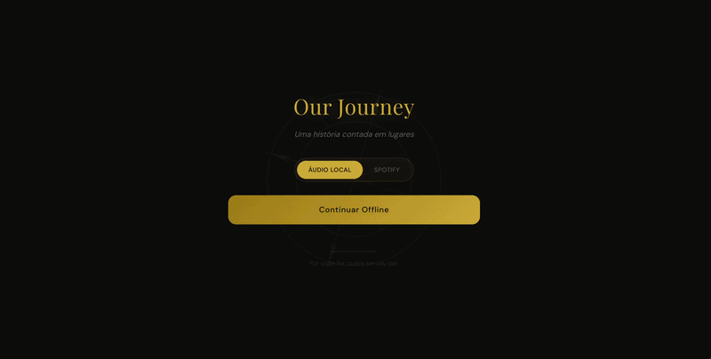
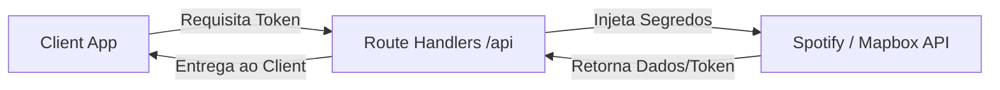

# Our Journey

**Cada pin é um pedaço nosso — um mapa vivo das viagens, encontros e histórias que só nós dois sabemos.**



Um projeto interativo que cataloga 38 locais que visitamos, combinando navegação geo-espacial, visualização de fotos e trilha sonora ambiente. Construído inicialmente como um presente, este repositório também serve como um showcase técnico de engenharia front-end.

[](https://nextjs.org/)
[](https://www.typescriptlang.org/)
[](https://tailwindcss.com/)
[](https://www.mapbox.com/)
[](https://cloudinary.com/)
[](https://www.framer.com/motion/)
<br>
[](https://github.com/Claytonrss/our-journey/actions)
[](https://vitest.dev/)
[](https://opensource.org/licenses/MIT)

**[our-journey-cm.vercel.app/map](https://our-journey-cm.vercel.app/map)**

---

## Destaques da Aplicação

- **Privacidade & Segurança First** — Uma tela de bloqueio com PIN numérico garante que apenas nós tenhamos acesso ao diário, protegida por rate limiting.
- **Mapa interativo com 38 pins** — Globo/mapa dark, fly-to automático no modo história, exploração livre, pins especiais (◆) com destaque dourado.
- **Modal editorial com foto hero + galeria** — Bottom sheet mobile / sidebar desktop, hero full-bleed, galeria masonry, lightbox com gestos.
- **Player de música ambiente** — Dual-mode: HTML5 local + Spotify Web Playback SDK.
- **Timeline cronológica** — Agrupada por ano, cards com parallax, linha dourada animada.
- **Intro cinematográfica** — Globo 3D rotacionando, copy sequencial animada, transição suave para o mapa.

---

## Engenharia e Arquitetura

O projeto demonstra engenharia front-end moderna: Next.js App Router com React 19, mapa WebGL persistente, CDN de imagens com transformações on-the-fly, autenticação em camadas e animações cinematográficas — tudo com tipagem estrita e validação Zod em runtime.

### Arquitetura (BFF Pattern)

A arquitetura adota o padrão **Backend-for-Frontend (BFF)** para proteger segredos de API (Spotify, Mapbox, Cloudinary). As chaves nunca são expostas ao cliente.



- **Overlay Pattern:** O contexto WebGL do Mapbox é caro. Em vez de desmontar o mapa durante a navegação, utilizamos um padrão de overlay (sobreposição), onde as views (detalhes do local, timeline) são renderizadas sobre o mapa de forma não destrutiva.

---

## Como Rodar

```bash
git clone https://github.com/Claytonrss/our-journey.git
cd our-journey
pnpm install
cp .env.example .env.local
# Edite .env.local com suas credenciais
pnpm run dev
```

Abra [http://127.0.0.1:3000](http://127.0.0.1:3000) — o dev server usa `127.0.0.1` para compatibilidade com redirect URIs do Spotify.

### Scripts

```bash
pnpm run dev          # Dev server em 127.0.0.1:3000
pnpm run build        # TypeScript check + build de produção
pnpm run lint         # ESLint
pnpm run format:check # Prettier check
pnpm run format       # Prettier write
pnpm run test         # Vitest (unit tests)
pnpm run test:e2e     # Playwright (E2E)
pnpm run generate     # Sync Cloudinary → memories.json
```

---

## Documentação Completa

| Documento                           | Conteúdo                                                       |
| ----------------------------------- | -------------------------------------------------------------- |
| [Arquitetura](docs/ARCHITECTURE.md) | Arquitetura operacional, fluxos, decisões técnicas, guardrails |
| [Engenharia](docs/ENGINEERING.md)   | Fluxo de trabalho, checklist de PR, comandos, convenções       |
| [Roadmap](docs/ROADMAP.md)          | Próximas fases: curto, médio e longo prazo                     |
| [Changelog](docs/CHANGELOG.md)      | Histórico de releases e melhorias                              |
| [Backlog](docs/BACKLOG.md)          | Itens não agendados por prioridade                             |

---

## Créditos

Desenvolvido por [Clayton Souza](https://github.com/Claytonrss) como presente de Dia dos Namorados para a Marina.

Cada pin no mapa é real; cada foto foi tirada por nós; cada descrição foi escrita pensando na pessoa que ia abrir isso.
