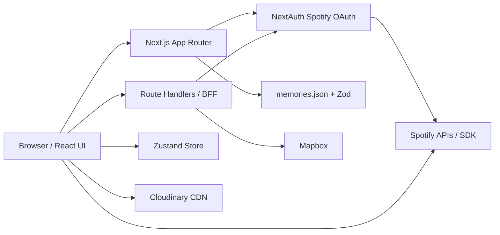

# Architecture

Este documento descreve a arquitetura atual do Our Journey e os guardrails para evoluir o projeto sem quebrar suas decisões centrais. O `docs/HLD.md` continua sendo a visão de alto nível; este arquivo é o guia operacional para entender onde cada coisa vive, como os fluxos passam pelo sistema e quais limites devem ser preservados.

## Objetivos Arquiteturais

- Preservar uma experiência interativa fluida, com o mapa WebGL como superfície principal.
- Manter segredos de Spotify, Mapbox e Cloudinary fora do client bundle.
- Concentrar integrações externas em camadas pequenas e fáceis de auditar.
- Validar contratos de dados estáticos antes que eles cheguem à UI.
- Favorecer uma estrutura simples de portfólio: legível, demonstrável e resiliente sem virar uma plataforma maior do que o problema.

## Stack

- Next.js 16 com App Router.
- React 19 e TypeScript.
- Tailwind CSS 4.
- NextAuth v5 beta com Spotify OAuth.
- Zustand para estado global leve.
- Mapbox GL via `react-map-gl`.
- Zod para contratos de dados.
- Cloudinary para imagens remotas.
- pnpm 9 como package manager.

## Visão Geral

O projeto é um monolito Next.js com padrão BFF. O mesmo app entrega a UI, server actions e route handlers que protegem credenciais de terceiros.



## Diretórios e Responsabilidades

| Caminho                    | Responsabilidade                                                               |
| -------------------------- | ------------------------------------------------------------------------------ |
| `src/app/`                 | Rotas App Router, páginas, route handlers e server actions.                    |
| `src/app/api/`             | BFF para dados sensíveis ou dependentes da sessão.                             |
| `src/components/features/` | Componentes agrupados por domínio de tela: auth, map, overlay, player e intro. |
| `src/components/ui/`       | Primitivos visuais compartilhados e sem regra de negócio específica.           |
| `src/hooks/`               | Estado global, integração de browser APIs e hooks de comportamento.            |
| `src/services/`            | Integrações e serviços reusáveis, como Spotify, áudio local e memórias.        |
| `src/types/`               | Schemas Zod e tipos derivados.                                                 |
| `src/data/`                | Conteúdo estático versionado. `memories.json` é gerado e validado em runtime.  |
| `scripts/`                 | Automação local, como geração de dados de memórias.                            |
| `docs/`                    | Produto, arquitetura, FDDs e planos técnicos.                                  |

## Fluxos Principais

### Entrada, Sessão e PIN

1. O usuário acessa `/`.
2. `src/app/page.tsx` roda no servidor e consulta `auth()`.
3. `LockScreen` recebe `hasSession` e decide se apresenta login Spotify ou validação de PIN.
4. O PIN é validado por `src/app/actions/auth.ts`, comparando com `SECRET_PIN`.
5. Depois do PIN validado, o estado `isPinValidated` no Zustand permite navegar para `/map`.

Guardrails:

- O PIN nunca deve ser validado no client.
- `SECRET_PIN` deve continuar privado e lido apenas no servidor.
- Qualquer nova camada de acesso deve compor com o fluxo atual, não substituí-lo silenciosamente.

### Autenticação Spotify

`src/auth.ts` concentra a configuração do NextAuth. Ele:

- normaliza `AUTH_URL` / `NEXTAUTH_URL`;
- força `127.0.0.1` em desenvolvimento quando necessário;
- configura o provider Spotify;
- renova access tokens expirados via refresh token;
- propaga `RefreshAccessTokenError` para a sessão.

Guardrails:

- Não acessar `SPOTIFY_CLIENT_SECRET` em componentes client.
- Não duplicar lógica de refresh token fora de `src/auth.ts` sem um motivo forte.
- Ao alterar redirect URI, validar desenvolvimento e produção.

### Mapa e Overlay

`src/app/map/page.tsx` é um componente client que orquestra:

- carregamento das memórias via `memoryService`;
- validação de WebGL;
- renderização de `MapView`;
- navegação entre memórias;
- overlay de conteúdo;
- player de áudio.

`MapView` é a instância WebGL principal e deve permanecer montada enquanto o usuário interage com memórias. O conteúdo entra como overlay sobre o mapa, evitando navegação baseada em rotas que remonte o Mapbox.

Guardrails:

- Não transformar cada memória em uma rota que desmonta o mapa.
- Preservar `reuseMaps` no Mapbox, salvo decisão arquitetural explícita.
- Novas experiências de conteúdo devem preferir overlay, sheet ou painel sobre o mapa.
- Falhas de Mapbox devem renderizar fallback visual, não tela quebrada.

### Áudio

`useAudioPlayer` escolhe entre Spotify Web Playback SDK e fallback HTML5:

- usa a sessão NextAuth para obter access token;
- inicializa `SpotifyService`;
- atualiza estado de faixa e play/pause no Zustand;
- quando há erro de autenticação ou inicialização, ativa áudio local via `HTML5AudioService`.

Guardrails:

- O player não deve bloquear a experiência principal do mapa.
- Erros de Spotify devem degradar para fallback local ou estado visual claro.
- Chamadas com access token devem passar por `/api/spotify-token` quando dependerem da sessão.

### Dados de Memórias

`src/data/memories.json` é a fonte de verdade consumida pela aplicação. `memoryService.getMemories()` importa o JSON e valida a lista com `MemorySchema`.

Contrato mínimo de cada memória:

- `id`
- `title`
- `date` no formato `YYYY-MM-DD`
- `coordinates.lat`
- `coordinates.lng`
- `isSpecialPin`
- `description`
- `images`

Guardrails:

- Atualizações de conteúdo devem passar pelo schema em `src/types/index.ts`.
- Alterações no formato do JSON devem atualizar schema, tipos, gerador e componentes consumidores.
- Falha de validação deve ser tratada como problema de conteúdo, não como erro silencioso aceitável.

## BFF e Segredos

Route handlers atuais:

| Rota                      | Responsabilidade                                    |
| ------------------------- | --------------------------------------------------- |
| `/api/mapbox-token`       | Entrega token Mapbox para o client.                 |
| `/api/spotify-token`      | Entrega access token Spotify da sessão autenticada. |
| `/api/auth/[...nextauth]` | Expõe handlers do NextAuth.                         |

Guardrails:

- Variáveis sem prefixo `NEXT_PUBLIC_` são privadas e não devem ser lidas por componentes client.
- `SPOTIFY_CLIENT_SECRET`, `MAPBOX_TOKEN`, `CLOUDINARY_API_SECRET` e `AUTH_SECRET` nunca devem aparecer no client bundle, logs de browser ou props serializadas.
- `/api/mapbox-token` deve usar somente `MAPBOX_TOKEN`; não criar fallback público para token de mapa.
- Novas integrações externas com segredo devem entrar por route handler, server action ou código server-only.

## Estado Global

O Zustand em `src/hooks/useAppStore.ts` guarda apenas estado de interação compartilhado:

- memória ativa;
- memória selecionada;
- modo de visualização;
- status do player;
- faixa atual;
- validação do PIN;
- uso de fallback local de áudio.

Guardrails:

- Não colocar dados derivados pesados no store.
- Não usar Zustand como cache genérico de API.
- Estado persistente no browser precisa ser deliberado e documentado.
- Quando o estado pertence a um componente isolado, preferir `useState` local.

## Client vs Server

Use componentes server por padrão em rotas e layouts. Use `'use client'` apenas quando houver:

- estado ou efeitos de browser;
- APIs como `window`, `sessionStorage`, WebGL ou áudio;
- hooks client, incluindo Zustand e `useSession`;
- animações e interações complexas.

Guardrails:

- Não importar serviços client-only em módulos server.
- Não acessar `process.env` privado em componentes client.
- Se uma feature precisa de segredo, a fronteira deve ser server-side.

## Configuração

Variáveis obrigatórias em produção:

| Variável                            | Exposição           | Uso                                  |
| ----------------------------------- | ------------------- | ------------------------------------ |
| `SECRET_PIN`                        | Privada             | Validação local do PIN.              |
| `AUTH_SECRET`                       | Privada             | Criptografia/assinatura do NextAuth. |
| `AUTH_URL` / `NEXTAUTH_URL`         | Privada             | URL canônica de autenticação.        |
| `SPOTIFY_CLIENT_ID`                 | Privada no servidor | OAuth Spotify.                       |
| `SPOTIFY_CLIENT_SECRET`             | Privada             | OAuth Spotify.                       |
| `NEXT_PUBLIC_SPOTIFY_PLAYLIST_URI`  | Pública             | Playlist usada pelo player.          |
| `MAPBOX_TOKEN`                      | Privada             | Token entregue via BFF.              |
| `CLOUDINARY_CLOUD_NAME`             | Privada             | Geração de conteúdo/imagens.         |
| `NEXT_PUBLIC_CLOUDINARY_CLOUD_NAME` | Pública             | Renderização de imagens Cloudinary.  |
| `CLOUDINARY_API_KEY`                | Privada             | Automação Cloudinary.                |
| `CLOUDINARY_API_SECRET`             | Privada             | Automação Cloudinary.                |

Validação central:

- `src/lib/env.ts` valida env server-side por domínio: PIN, auth/Spotify, Mapbox e Cloudinary.
- `src/lib/publicEnv.ts` valida env pública consumida no client.
- Novas env vars devem entrar nesses módulos antes de serem usadas por features.

## Resiliência Atual

O projeto já possui alguns mecanismos de degradação:

- `MapErrorBoundary` e `MapFallback` para problemas no mapa.
- `useWebGLSupport` antes de renderizar Mapbox.
- fallback para áudio local quando Spotify falha.
- refresh token no callback JWT do NextAuth.
- validação runtime de `memories.json`.

Lacunas conhecidas:

- falta timeout padronizado para chamadas externas;
- logs ainda são ad hoc com `console`;
- route handlers ainda não usam envelope de erro padronizado;
- não há testes automatizados para contratos críticos.

## Observabilidade

Estado atual:

- logs simples em falhas de token, Mapbox, Spotify e validação de memórias;
- sem camada centralizada de métricas, tracing ou error reporting.

Guardrails:

- Logs server-side não devem incluir tokens, secrets ou payloads sensíveis.
- Logs devem informar contexto suficiente: serviço, rota, status e ação que falhou.
- Erros esperados de serviços externos devem virar estados de UI ou respostas HTTP controladas.

## Qualidade e Verificação

Comandos oficiais:

```bash
pnpm run lint
pnpm run format:check
pnpm run build
```

O build executa a geração de memórias via `prebuild` e depois `next build`.

Guardrails:

- Usar sempre pnpm.
- Rodar `pnpm run build` antes de entregar mudanças que alterem tipos, rotas, dados ou build config.
- Rodar `pnpm run lint` e `pnpm run format:check` antes de abrir PR.
- Como não há suíte de testes, mudanças em contratos críticos devem ser verificadas por build e revisão manual direcionada.

## Estratégia de Testes

O projeto ainda não possui suíte automatizada. A meta é adicionar testes de forma incremental, cobrindo primeiro os pontos que protegem arquitetura, segredos e experiência principal, sem criar manutenção desproporcional para um projeto de portfólio.

### Pirâmide Desejada

| Camada          | Ferramenta proposta            | Papel                                                                                     |
| --------------- | ------------------------------ | ----------------------------------------------------------------------------------------- |
| Unitários       | Vitest + React Testing Library | Validar schemas, helpers, services puros, hooks isoláveis e componentes com lógica local. |
| Integração leve | Vitest / Route Handler tests   | Validar BFF, env, contratos HTTP e tratamento de erros sem browser real.                  |
| E2E             | Playwright                     | Validar jornadas críticas reais: PIN, mapa, overlay, fallback e responsividade.           |

### Plano Unitário

Prioridade 1:

- `MemorySchema` e `ImageSchema` aceitam dados válidos e rejeitam formatos inválidos.
- `memoryService.getMemories()` retorna lista validada e falha de forma controlada.
- validação centralizada de env separa contratos server e public.
- helpers puros, como `cn()`, continuam previsíveis.

Prioridade 2:

- stores e hooks com lógica própria, especialmente transições do `useAppStore`.
- route handlers `/api/mapbox-token` e `/api/spotify-token`, cobrindo sucesso, ausência de env e ausência de sessão.
- `refreshAccessToken` deve ser extraído para função testável antes de receber testes diretos.

Prioridade 3:

- componentes pequenos com decisão de UI, como fallback de mapa, estados do player e lock screen.
- fluxo de fallback do áudio por contrato de serviço, com Spotify mockado.

Guardrails:

- Testes unitários não devem chamar Spotify, Mapbox ou Cloudinary reais.
- Preferir fixtures pequenas e explícitas em vez de reaproveitar todo `memories.json`.
- Não testar detalhes internos de animação do Framer Motion.
- Não tornar componentes server/client mais acoplados só para facilitar teste.

### Plano E2E com Playwright

Cenários iniciais:

- Home renderiza o fluxo correto quando não há sessão Spotify.
- PIN inválido não libera o mapa.
- PIN válido libera a navegação para `/map`.
- `/map` exibe fallback quando WebGL ou token Mapbox falha.
- Com Mapbox mockado, o usuário consegue abrir uma memória e fechar o overlay.
- Em viewport mobile, o overlay não cobre controles essenciais de forma quebrada.
- Falha do Spotify não bloqueia o mapa e ativa caminho de fallback visual/funcional.

Estratégia de mocks:

- Mockar `/api/mapbox-token` em testes E2E para evitar depender de token real.
- Interceptar scripts/APIs do Spotify quando a jornada não estiver validando OAuth real.
- Usar fixtures de memórias pequenas quando possível.
- Reservar qualquer teste com integração real para smoke manual ou ambiente separado.

Comandos futuros recomendados:

```bash
pnpm run test
pnpm run test:e2e
pnpm run test:e2e:ui
```

Critério de entrada no CI:

- Começar com unitários de contrato e um smoke E2E feliz.
- Depois exigir `pnpm run test` em toda PR.
- Tornar `pnpm run test:e2e` obrigatório apenas quando estiver estável em ambiente local/CI.

## Evolução Recomendada

Prioridade alta:

- Padronizar respostas e erros dos route handlers.
- Adicionar timeout e tratamento uniforme para chamadas externas.
- Criar base de testes unitários para schemas, env e route handlers críticos.

Prioridade média:

- Criar script dedicado para validar `memories.json`.
- Adicionar Playwright com smoke E2E de PIN, mapa mockado e overlay.
- Formalizar checklist de PR em `docs/ENGINEERING.md` ou `docs/CONTRIBUTING.md`.

Prioridade baixa:

- Avaliar observabilidade externa, como Sentry, apenas se o projeto for publicado e acessado por terceiros.
- Criar ADRs para decisões que mudem fronteiras arquiteturais, como CMS, nova camada de dados ou novo provedor de áudio.

## Checklist Para Novas Features

Antes de implementar:

- A feature precisa de segredo? Se sim, ela deve passar pelo servidor.
- A feature desmonta ou substitui o mapa? Se sim, repensar como overlay.
- O estado precisa ser global? Se não, manter local.
- Existe contrato de dados novo? Se sim, criar schema Zod.
- Existe caminho de falha externo? Se sim, definir fallback visual ou funcional.
- A mudança afeta auth, PIN, mapa ou player? Se sim, rodar build e fazer smoke test manual.
