# Fluxos de Dados

Este diagrama mostra os fluxos reais das principais funcionalidades: desbloqueio por PIN, carregamento de memórias, mapa/overlay, timeline e audio.

```mermaid
flowchart TD
  User["Usuario"]
  Home["/ page server component"]
  AuthCheck["auth()"]
  Lock["LockScreen"]
  PinAction["validatePin(pin) server action"]
  PinEnv["SECRET_PIN"]
  Store["useAppStore"]
  MapPage["/map client page"]
  TimelinePage["/timeline client page"]
  MemoryService["memoryService.getMemories()"]
  Zod["z.array(MemorySchema)"]
  Memories["src/data/memories.json"]
  MapToken["GET /api/mapbox-token"]
  MapboxEnv["MAPBOX_TOKEN"]
  MapView["MapView + MemoryPin"]
  Overlay["Overlay + MasonryGallery + Lightbox"]
  Cloudinary["Cloudinary image delivery"]
  GlobalAudio["GlobalAudio"]
  SpotifyToken["GET /api/spotify-token"]
  NextAuthSession["NextAuth session"]
  SpotifySdk["Spotify Web Playback SDK"]
  LocalAudio["HTML5AudioService /audio/background.mp3"]

  User --> Home
  Home --> AuthCheck
  Home --> Lock
  Lock --> PinAction
  PinAction --> PinEnv
  PinAction --> Lock
  Lock --> Store
  Store --> MapPage
  Store --> TimelinePage

  MapPage --> MemoryService
  TimelinePage --> MemoryService
  MemoryService --> Memories
  MemoryService --> Zod
  Zod --> MapPage
  Zod --> TimelinePage

  MapPage --> MapToken
  Lock --> MapToken
  MapToken --> MapboxEnv
  MapToken --> MapView
  MapView --> Overlay
  Overlay --> Cloudinary
  TimelinePage --> Cloudinary

  Store --> GlobalAudio
  GlobalAudio --> NextAuthSession
  GlobalAudio --> SpotifyToken
  SpotifyToken --> NextAuthSession
  GlobalAudio --> SpotifySdk
  SpotifySdk --> SpotifyToken
  GlobalAudio --> LocalAudio
```

Notas de leitura:

- A criacao/edicao de memorias nao existe como funcionalidade de produto. O fluxo atual e operacional: editar `memories-source.json`, executar `pnpm run generate` com Cloudinary configurado e versionar `memories.json`.
- O audio tenta Spotify quando ha sessao e cai para audio local quando a inicializacao/autenticacao falha.
- O acesso a `/map` e `/timeline` depende do estado client-side `isPinValidated`; nao ha middleware persistente de autorizacao entre reloads.
