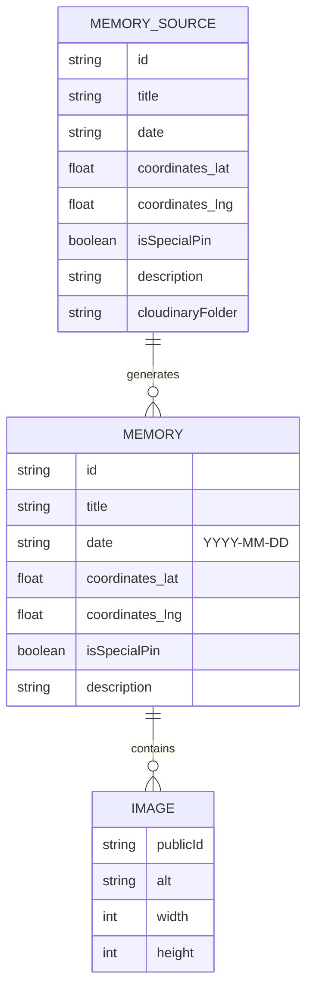

# Modelo de Dados

O modelo atual e composto por entidades JSON validadas com Zod. Nao ha banco relacional, tabelas Supabase ou API CRUD de memorias neste estado do codigo.

Contratos reais:

- `ImageSchema` fica em `src/types/index.ts` e exige `publicId`, `alt`, `width` e `height`.
- `MemorySchema` fica em `src/types/index.ts` e exige `id`, `title`, `date`, `coordinates`, `isSpecialPin`, `description` e `images`.
- `src/data/memories.json` contem 38 memorias e 414 imagens no diagnostico executado.
- `src/data/memories-source.json` adiciona `cloudinaryFolder`, usado por `scripts/generate-memories.ts` para buscar assets no Cloudinary.
