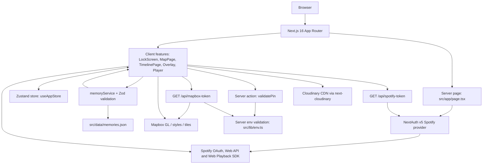

# Arquitetura Geral

Este diagrama representa o estado atual do Our Journey: um monolito Next.js App Router com UI client-heavy para mapa, timeline, overlay e audio, mais route handlers/server actions protegendo segredos de Spotify, Mapbox e PIN.

Pontos importantes:

- Nao ha Supabase no codigo atual. O modelo persistido e `src/data/memories.json`, gerado a partir de `src/data/memories-source.json` e Cloudinary.
- Mapbox e Spotify sao integrados por um padrao BFF: segredos ficam em env server-side e sao acessados por route handlers ou NextAuth.
- O mapa principal fica no client e usa `reuseMaps`; overlays e controles sao renderizados sobre a superficie WebGL.
