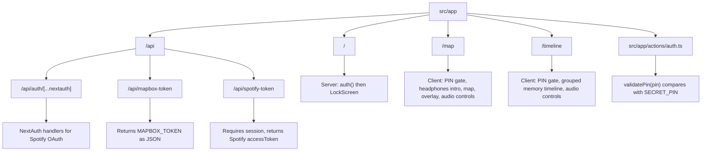

# Estrutura de Rotas

Este diagrama lista as rotas App Router e endpoints encontrados no codigo atual.

Observacoes:

- `/` e dinamica no build por depender de `auth()`.
- `/map` e `/timeline` foram prerenderizadas como estaticas no build, mas executam guardas client-side em runtime.
- `/api/mapbox-token` nao exige PIN ou sessao; ele entrega o token Mapbox para qualquer chamada ao endpoint.
- `/api/spotify-token` exige sessao NextAuth valida.
