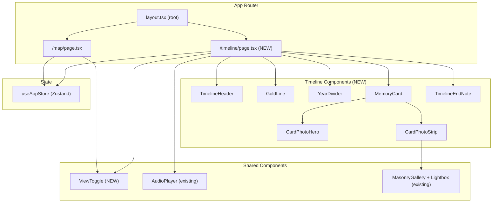

# Timeline View — Plano de Implementação

## Contexto

O mapa (`/map`) responde **"onde fomos"**. A timeline responde **"como chegamos até aqui"**. São dimensões complementares — espacial vs. temporal. A timeline não compete com o mapa: ela aprofunda a experiência para quem quer reviver a história em ordem cronológica, sentindo o relacionamento crescer.

A direção visual é a mesma do projeto: **Memory as Editorial**. No mapa você explora livremente; na timeline você lê uma história com começo, meio e — por enquanto — sem fim.

**Rota:** `/timeline`
**Toggle:** compartilhado entre `/map` e `/timeline`

---

## User Review Required

> [!IMPORTANT]
> **Interação ao clicar em um card**: ao clicar em um MemoryCard na timeline, a proposta é **navegar para `/map` com o `activeMemoryId` já setado**, executando o flyTo automaticamente. Isso reutiliza toda a lógica do Overlay + Spotify player sem duplicar código. Confirma essa abordagem?

> [!WARNING]
> **Impacto no layout do mapa**: o `ViewToggle` fixo no bottom vai ocupar espaço que hoje é do `NavigationOverlay`. O `NavigationOverlay` continuará visível **apenas na view `/map`**, e o `ViewToggle` ficará presente em **ambas as views**. O toggle ficará posicionado acima do NavigationOverlay no mapa e sozinho no bottom da timeline.

> [!IMPORTANT]
> **GoldLine no iOS**: o elemento `position: absolute` com `height: 100%` no scroll container pode causar problemas com bounce scroll no Safari/iOS. A implementação usará `pointer-events: none` e será testada com cuidado. Se houver problemas, a alternativa é usar `position: fixed` com `scaleY` calculado via JS.

---

## Open Questions

1. **Quantidade de memórias**: Atualmente há apenas 1 memória em `memories.json`. O plano assume que serão adicionadas mais memórias antes da implementação, ou devo trabalhar com dados mockados para testar a timeline visualmente? (O layout com uma única memória vai parecer incompleto.)

2. **Player na timeline**: O AudioPlayer pill (flutuante) deve aparecer na timeline ou só no mapa? Minha recomendação: mostrar o pill na timeline também, já que a música ambienta a experiência de leitura.

3. **IntroScreen**: A intro atual (`/map`) direciona para o mapa. Quando o usuário clicar em "Vamos lá", ele deve ir para `/map` ou `/timeline`? Recomendo manter o mapa como destino padrão da intro.

---

## Proposed Changes

### Visão Geral da Arquitetura



---

### 1. Estado Global — Extensão do Zustand Store

#### [MODIFY] [useAppStore.ts](file:///Users/clayton/Documents/develop/our-journey/src/hooks/useAppStore.ts)

Adicionar `currentView` ao estado global para sincronizar o ViewToggle entre as views:

```diff
 export interface AppState {
   activeMemoryId: string | null;
   selectedMemoryId: string | null;
   viewMode: 'story' | 'free';
+  currentView: 'map' | 'timeline';
   isPlaying: boolean;
   // ...

+  setCurrentView: (view: 'map' | 'timeline') => void;
 }
```

> [!NOTE]
> O `currentView` é necessário para que o ViewToggle reflita corretamente a view ativa, já que ele será renderizado em ambas as páginas. Alternativamente, podemos derivar isso do pathname via `usePathname()` — isso evitaria estado duplicado. **Recomendo usar `usePathname()` e não adicionar ao store.**

**Decisão final: usar `usePathname()` no ViewToggle em vez de estado global.** Menos estado = menos bugs.

---

### 2. Tipos — Sem Alterações

O schema `Memory` existente em [index.ts](file:///Users/clayton/Documents/develop/our-journey/src/types/index.ts) já contém todos os campos necessários:

- `id`, `title`, `date` (YYYY-MM-DD), `coordinates`, `isSpecialPin`, `description`, `images[]`

A timeline agrupa por ano extraído de `date` e ordena cronologicamente. Nenhum campo novo é necessário.

---

### 3. Timeline Components (NOVOS)

#### [NEW] `src/components/features/timeline/TimelinePage.tsx`

Componente raiz da timeline. Responsabilidades:

- Carregar memórias via `memoryService.getMemories()`
- Agrupar memórias por ano (`Map<number, Memory[]>`)
- Ordenar cronologicamente (mais antiga primeiro)
- Calcular stats (total lugares, span de anos, total de fotos)
- Renderizar `TimelineHeader` → `[YearDivider + MemoryCard[]]` por grupo → `TimelineEndNote`
- Instanciar `useScroll()` do Framer Motion no scroll container para alimentar `GoldLine`
- Guard de auth: redirecionar para `/` se `!isPinValidated`

```tsx
// Pseudo-estrutura
<main ref={containerRef} className="relative min-h-screen overflow-y-auto">
  <GoldLine scrollYProgress={scrollYProgress} />
  <div className="relative ml-[40px] md:ml-[60px]">
    {' '}
    {/* Conteúdo à direita da linha */}
    <TimelineHeader stats={stats} />
    {yearGroups.map(([year, memories]) => (
      <React.Fragment key={year}>
        <YearDivider year={year} />
        {memories.map((memory) => (
          <MemoryCard
            key={memory.id}
            memory={memory}
            onNavigateToMap={handleNavigateToMap}
          />
        ))}
      </React.Fragment>
    ))}
    <TimelineEndNote />
  </div>
  <ViewToggle />
  <AudioPlayer isPlaying={isPlaying} onTogglePlay={togglePlay} />
</main>
```

---

#### [NEW] `src/components/features/timeline/TimelineHeader.tsx`

Topo da página, antes do primeiro card. Cria a sensação de magnitude.

**Layout:**

```
"Nossa história"                    ← Playfair Display italic, 13px, --gold, opacity 0.6
━━━━━━━━━━━━━━━                     ← Linha dourada 28px, scaleX animado

39 lugares ◆ 8 anos ◆ 214 fotos    ← DM Sans 300, 14px, --text-muted
```

**Props:**

```ts
interface TimelineHeaderProps {
  totalPlaces: number;
  yearSpan: number;
  totalPhotos: number;
}
```

**Animações:**

- Texto entra com `initial={{ opacity: 0, y: 10 }}` e `animate={{ opacity: 1, y: 0 }}` com `delay: 0.2`
- Linha dourada entra com `scaleX: 0 → 1` com `delay: 0.5`
- Stats entram com `delay: 0.8`

**Estilo visual** — mesmo padrão do modal da IntroScreen: Playfair para títulos, DM Sans para dados, dourado como accent.

---

#### [NEW] `src/components/features/timeline/GoldLine.tsx`

O elemento visual mais poderoso da view. Linha vertical de 1px na esquerda que se desenha conforme o scroll.

```tsx
interface GoldLineProps {
  scrollYProgress: MotionValue<number>;
}
```

**Implementação:**

```tsx
<motion.div
  className="absolute top-0 left-[20px] md:left-[30px] w-[1px] pointer-events-none"
  style={{
    height: '100%',
    background: 'var(--gold)',
    opacity: 0.18,
    scaleY: scrollYProgress,
    transformOrigin: 'top',
  }}
/>
```

**Detalhes técnicos:**

- `position: absolute` relativo ao scroll container
- `pointer-events: none` para não interferir no scroll
- `transformOrigin: 'top'` para a escala crescer de cima para baixo
- Background track (a "trilha" da linha) com `rgba(212,175,55,0.06)` — visível mas discreta
- Linha ativa com `rgba(212,175,55,0.18)` — sutil mas presente

---

#### [NEW] `src/components/features/timeline/YearDivider.tsx`

Separador de capítulo. Marca a transição entre anos.

**Layout:**

```
──────────────── 2016 ────────────────
◆ (dot na posição da GoldLine)
```

**Props:**

```ts
interface YearDividerProps {
  year: number;
}
```

**Estilo:**

- Ano em **Playfair Display**, `clamp(40px, 6vw, 56px)`
- Cor: `rgba(212,175,55,0.08)` — quase invisível, marca d'água
- Dot maior (8px) posicionado na GoldLine com `background: var(--gold)`, `opacity: 0.4`
- Linhas horizontais tracejadas com `border-top: 1px solid rgba(212,175,55,0.06)`

**Animações:**

- Ano desliza da esquerda: `initial={{ x: -16, opacity: 0 }}`, `whileInView={{ x: 0, opacity: 1 }}`
- Dot pulsa uma vez: anel expandindo `scale: [1, 1.8]`, `opacity: [0.6, 0]`, `duration: 0.6s`
- `viewport={{ once: true }}`

---

#### [NEW] `src/components/features/timeline/MemoryCard.tsx`

O coração da view. Card estático (sem drag/bottom sheet) que mostra a memória na timeline.

**Props:**

```ts
interface MemoryCardProps {
  memory: Memory;
  onNavigateToMap: (memoryId: string) => void;
}
```

**Layout:**

```
┌─────────────────────────────────────┐
│  [CardPhotoHero]                    │  ← foto hero, gradient, data+título sobrepostos
│  ━━━━━━━━━━━━━━━━━━━━━━━━━━━━━━━━━  │  ← linha dourada 40px, opacity 0.4
│  Descrição em DM Sans 14px          │
│  [CardPhotoStrip]                   │  ← galeria horizontal (se > 1 foto)
│  ─────────────────────────────────  │
│  Botão "Ver no mapa →"             │  ← link para /map com flyTo
└─────────────────────────────────────┘
```

**Estilo do card:**

- `background: var(--bg-panel)` — `#101010`
- `border-radius: 16px`
- `border: 1px solid rgba(255,255,255,0.04)`
- Se `isSpecialPin`: `border: 1px solid rgba(212,175,55,0.2)` e ◆ no título
- `margin-bottom: 32px`
- Dot (6px) posicionado na GoldLine à esquerda, na altura do card

**Animação scroll-triggered:**

```tsx
<motion.div
  initial={{ opacity: 0, y: 40 }}
  whileInView={{ opacity: 1, y: 0 }}
  viewport={{ once: true, margin: '-80px' }}
  transition={{ duration: 0.7, ease: [0.16, 1, 0.3, 1] }}
>
```

**Stagger interno** (data → título → separador → descrição):

```tsx
staggerChildren: 0.12;
delayChildren: 0.3; // espera o card entrar
```

**Click action:** `onNavigateToMap(memory.id)` → seta `activeMemoryId` no store → `router.push('/map')` → mapa executa flyTo automaticamente via `useMapFlyTo`.

---

#### [NEW] `src/components/features/timeline/CardPhotoHero.tsx`

Foto hero do card com gradient e texto sobreposto.

**Props:**

```ts
interface CardPhotoHeroProps {
  memory: Memory;
  cardRef: React.RefObject<HTMLDivElement>;
}
```

**Layout:**

- Foto `object-fit: cover`, altura `clamp(140px, 30vw, 200px)`
- `border-radius: 16px 16px 0 0`
- Gradient de `rgba(10,10,10,1)` (bottom) a `transparent` (top)
- Data em **Playfair italic 11px**, cor `--gold`
- Título em **Playfair 18px**, cor `--text-primary`
- Usa `CldImage` (Cloudinary) — mesmo padrão do [Overlay.tsx](file:///Users/clayton/Documents/develop/our-journey/src/components/features/overlay/Overlay.tsx#L81-L91)

**Parallax:**

```tsx
const { scrollYProgress } = useScroll({ target: cardRef });
const y = useTransform(scrollYProgress, [0, 1], ['0%', '15%']);
// Foto se move a ~60% da velocidade do scroll
```

---

#### [NEW] `src/components/features/timeline/CardPhotoStrip.tsx`

Galeria horizontal de fotos extras. **Reutiliza a lógica do `MasonryGallery` e `Lightbox` existentes.**

**Implementação:**

- Renderiza as fotos `memory.images.slice(1)` em scroll horizontal
- Cada thumbnail é um `CldImage` com `aspect-ratio: 4/3`, `border-radius: 8px`
- Ao clicar, abre o [Lightbox](file:///Users/clayton/Documents/develop/our-journey/src/components/features/overlay/MasonryGallery.tsx#L153-L326) existente
- Scroll horizontal com `-webkit-overflow-scrolling: touch` para iOS
- Scrollbar oculta via CSS

```tsx
<div className="flex gap-2 overflow-x-auto scrollbar-hide pb-2">
  {extraImages.map((img, i) => (
    <button key={i} onClick={() => openLightbox(i + 1)}>
      <CldImage src={img.publicId} ... />
    </button>
  ))}
</div>
```

---

#### [NEW] `src/components/features/timeline/TimelineEndNote.tsx`

Aparece após o último card. Momento de pausa intencional.

**Layout:**

```
│
│  (linha dourada 40px)
│
   "E ainda tem tanto pela frente."   ← Playfair italic 14px, --text-muted
```

**Animação:**

- Fade lento de **1.2s** com `ease: "easeIn"` — lentidão proposital
- Só monta quando o último card entra em viewport (lazy)
- `viewport={{ once: true }}`

---

#### [NEW] `src/components/features/timeline/index.ts`

Barrel export de todos os componentes da timeline.

---

### 4. ViewToggle — Componente Compartilhado

#### [NEW] `src/components/ui/ViewToggle.tsx`

Pill fixo no bottom center, presente em `/map` e `/timeline`.

**Layout:**

```
┌──────────────────────────────┐
│   Mapa    │  Linha do tempo  │
└──────────────────────────────┘
```

**Estilo:**

- `position: fixed`, `bottom: 24px` (timeline) / `bottom: 92px` (mapa, acima do NavigationOverlay)
- `left: 50%`, `transform: translateX(-50%)`
- `background: rgba(17, 17, 17, 0.85)`
- `backdrop-filter: blur(20px)`
- `border: 1px solid var(--gold-line)`
- `border-radius: 99px` (pill)
- `padding: 4px`
- `z-index: 20`

**Estado ativo:**

- `background: var(--gold-dim)` — `rgba(212, 175, 55, 0.12)`
- `color: var(--gold)` — `#d4af37`
- `border-radius: 99px`

**Estado inativo:**

- `background: transparent`
- `color: var(--text-muted)`

**Implementação:**

- Usa `usePathname()` do Next.js para determinar a view ativa
- Usa `router.push()` para navegar
- Entrada com `initial={{ y: 12, opacity: 0 }}`, `animate={{ y: 0, opacity: 1 }}`

**Prop para posição dinâmica:**

```ts
interface ViewToggleProps {
  bottomOffset?: string; // '24px' na timeline, '92px' no mapa
}
```

---

### 5. Página da Timeline (App Router)

#### [NEW] `src/app/timeline/page.tsx`

```tsx
'use client';

import { TimelinePage } from '@/components/features/timeline/TimelinePage';

export default function TimelineRoute() {
  return <TimelinePage />;
}
```

A lógica real fica no `TimelinePage` component — a page é apenas um wrapper, seguindo o mesmo padrão de [map/page.tsx](file:///Users/clayton/Documents/develop/our-journey/src/app/map/page.tsx).

---

### 6. Integração na Page do Mapa

#### [MODIFY] [page.tsx](file:///Users/clayton/Documents/develop/our-journey/src/app/map/page.tsx)

Adicionar o `ViewToggle` ao layout do mapa:

```diff
+ import { ViewToggle } from '@/components/ui/ViewToggle';

  return (
    <main className="relative min-h-screen">
      {/* ... MapView, NavigationOverlay, Overlay, AudioPlayer ... */}
+     <ViewToggle bottomOffset="92px" />
    </main>
  );
```

---

### 7. Transição entre Views

#### Animação `/map` ↔ `/timeline`

Idealmente usaríamos `AnimatePresence` no layout pai para animar a transição. Porém, com App Router do Next.js 16, as transições entre routes são complexas.

**Abordagem pragmática:** cada page anima sua própria entrada:

- **Timeline entra:** `initial={{ opacity: 0 }}` → `animate={{ opacity: 1 }}` em 0.4s
- **Mapa entra:** mesmo padrão

> [!NOTE]
> Uma transição mais sofisticada (`x: -24` → `x: 0`) exigiria um layout wrapper com `AnimatePresence` interceptando o routing. Isso é possível mas adiciona complexidade. Recomendo começar com fade simples e iterar se necessário.

---

### 8. CSS Global — Adições

#### [MODIFY] [globals.css](file:///Users/clayton/Documents/develop/our-journey/src/app/globals.css)

```css
/* Scrollbar oculta para strips horizontais */
.scrollbar-hide {
  -ms-overflow-style: none;
  scrollbar-width: none;
}
.scrollbar-hide::-webkit-scrollbar {
  display: none;
}

/* Keyframe para o pulse do YearDivider dot */
@keyframes year-dot-pulse {
  0% {
    transform: scale(1);
    opacity: 0.6;
  }
  100% {
    transform: scale(1.8);
    opacity: 0;
  }
}
```

---

## Estrutura Final de Arquivos

```
src/
├── app/
│   ├── timeline/
│   │   └── page.tsx                    [NEW]
│   ├── map/
│   │   └── page.tsx                    [MODIFY] — adicionar ViewToggle
│   └── globals.css                     [MODIFY] — scrollbar-hide, keyframes
├── components/
│   ├── features/
│   │   └── timeline/
│   │       ├── index.ts                [NEW]
│   │       ├── TimelinePage.tsx         [NEW]
│   │       ├── TimelineHeader.tsx       [NEW]
│   │       ├── GoldLine.tsx             [NEW]
│   │       ├── YearDivider.tsx          [NEW]
│   │       ├── MemoryCard.tsx           [NEW]
│   │       ├── CardPhotoHero.tsx        [NEW]
│   │       ├── CardPhotoStrip.tsx       [NEW]
│   │       └── TimelineEndNote.tsx      [NEW]
│   └── ui/
│       └── ViewToggle.tsx              [NEW]
```

**Total: 10 arquivos novos, 2 arquivos modificados. Zero dependências novas.**

---

## Reuso de Componentes Existentes

| Componente existente                                                                                                                | Uso na Timeline                                                              |
| ----------------------------------------------------------------------------------------------------------------------------------- | ---------------------------------------------------------------------------- |
| [MasonryGallery + Lightbox](file:///Users/clayton/Documents/develop/our-journey/src/components/features/overlay/MasonryGallery.tsx) | Reutilizado integralmente no `CardPhotoStrip` para abrir fotos em fullscreen |
| [AudioPlayer](file:///Users/clayton/Documents/develop/our-journey/src/components/features/player/AudioPlayer.tsx)                   | Pill variant flutuando na timeline                                           |
| [CldImage](file:///Users/clayton/Documents/develop/our-journey/src/components/features/overlay/Overlay.tsx#L81)                     | Mesmo padrão Cloudinary para fotos hero e strips                             |
| [memoryService](file:///Users/clayton/Documents/develop/our-journey/src/services/memoryService.ts)                                  | Mesma fonte de dados `memories.json`                                         |
| [useAppStore](file:///Users/clayton/Documents/develop/our-journey/src/hooks/useAppStore.ts)                                         | Compartilha `activeMemoryId` para navegação timeline → mapa                  |
| [useAudioPlayer](file:///Users/clayton/Documents/develop/our-journey/src/hooks/useAudioPlayer.ts)                                   | Player de áudio na timeline                                                  |

---

## Catálogo de Animações

| #   | Animação              | Componente            | Trigger                 | Detalhe                                                            |
| --- | --------------------- | --------------------- | ----------------------- | ------------------------------------------------------------------ |
| 1   | Card reveal           | `MemoryCard`          | `whileInView`           | `opacity: 0→1, y: 40→0`, 0.7s, ease `[0.16,1,0.3,1]`, `once: true` |
| 2   | Linha se desenhando   | `GoldLine`            | `scrollYProgress`       | `scaleY: 0→1`, `transformOrigin: top`                              |
| 3   | Parallax foto         | `CardPhotoHero`       | `useScroll({ target })` | `y: 0% → 15%` na foto, ~60% velocidade do scroll                   |
| 4   | YearDivider slide     | `YearDivider`         | `whileInView`           | `x: -16→0, opacity: 0→1`, `once: true`                             |
| 5   | YearDivider dot pulse | `YearDivider`         | `whileInView`           | Anel: `scale: [1, 1.8], opacity: [0.6, 0]`, 0.6s, `once: true`     |
| 6   | Stagger interno       | `MemoryCard` children | Parent `whileInView`    | `staggerChildren: 0.12`, `delayChildren: 0.3`                      |
| 7   | EndNote fade          | `TimelineEndNote`     | `whileInView`           | `opacity: 0→1`, 1.2s, `ease: "easeIn"`, `once: true`               |
| 8   | Page enter            | `TimelinePage`        | Mount                   | `opacity: 0→1`, 0.4s                                               |

---

## Verification Plan

### Build Check

```bash
pnpm run build
```

Garante zero erros TypeScript e que a rota `/timeline` é gerada corretamente.

### Lint & Format

```bash
pnpm run lint
pnpm run format:check
```

### Manual Verification

1. **Navegação:** acessar `/timeline` diretamente e via ViewToggle a partir do `/map`
2. **Auth guard:** verificar redirecionamento para `/` quando `isPinValidated === false`
3. **GoldLine:** scroll completo e verificar que a linha cresce suavemente de 0% a 100%
4. **Cards:** verificar que todas as animações `whileInView` disparam uma vez ao scrollar
5. **Parallax:** verificar profundidade na foto hero ao scrollar
6. **Lightbox:** clicar em foto do strip e navegar pelo lightbox
7. **Click no card:** verificar que navega para `/map` e executa flyTo na memória
8. **AudioPlayer:** verificar que o pill aparece e funciona na timeline
9. **Mobile (iOS Safari):** testar scroll suave, sem conflito com bounce, lightbox funcional
10. **ViewToggle:** verificar estado ativo correto em cada view, transição suave

### Responsividade

- Desktop: `ml-[60px]`, cards com `max-width: 640px`
- Mobile: `ml-[40px]`, cards full-width com padding lateral
- Testar em 375px (iPhone SE), 390px (iPhone 14), 768px (iPad), 1440px (Desktop)
