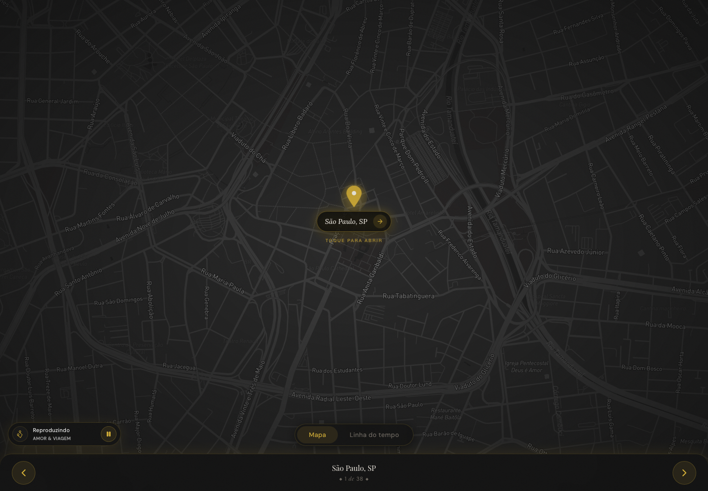

# Plano de Melhorias - Our Journey

## Resumo Executivo

O Our Journey esta em bom estado para um projeto de portfolio interativo: usa Next.js 16 App Router, React 19, TypeScript, Tailwind CSS 4, NextAuth v5 com Spotify, Mapbox via `react-map-gl`, Cloudinary para imagens, Zustand para estado client e Zod para contratos de dados. A arquitetura BFF esta bem encaminhada: segredos de Spotify e Mapbox nao aparecem diretamente em componentes client, e os dados de memorias sao validados em runtime.

Diagnostico de qualidade executado em 2026-06-13:

- `pnpm run lint`: passou com 7 warnings e 0 errors.
- `pnpm run build`: falhou inicialmente no sandbox por falta de rede para `next/font/google`; passou com rede habilitada.
- `pnpm run test`: passou com 14 arquivos e 88 testes.
- `pnpm run test:coverage`: passou com 75.2% statements/lines, 91.25% branches, 90.47% functions.
- `pnpm audit --audit-level moderate`: falhou por vulnerabilidades conhecidas, incluindo 1 critica em Vitest, 2 altas em esbuild e vulnerabilidades moderadas em Vite/PostCSS.

Prioridades macro:

- Alto risco: atualizar toolchain de testes/build para corrigir advisories, adicionar protecao contra brute force no PIN e revisar exposicao do token Mapbox.
- Medio risco: adicionar Playwright E2E ao CI, configurar headers de seguranca, corrigir docs desatualizados e estabilizar tratamento de erros/logs.
- Baixo risco: melhorar observabilidade, screenshots no README e documentacao de operacao.

## 0. Diagnostico de Qualidade Atual (Lint, Build, Testes)

### Scripts reais em `package.json`

| Script          | Comando                         | Observacao                                            |
| --------------- | ------------------------------- | ----------------------------------------------------- |
| `dev`           | `next dev --hostname 127.0.0.1` | Porta padrao 3000, hostname coerente com OAuth local. |
| `build`         | `next build`                    | Inclui typecheck do Next.                             |
| `lint`          | `eslint`                        | Hoje tambem varre `coverage/`, gerando warnings.      |
| `format:check`  | `prettier --check .`            | Usado no CI e pre-push.                               |
| `test`          | `vitest run`                    | Suite existente.                                      |
| `test:coverage` | `vitest run --coverage`         | Coverage com thresholds em `vitest.config.ts`.        |

### Lint

Resultado: passou.

- Total: 7 warnings, 0 errors.
- Regras afetadas:
  - `@typescript-eslint/no-unused-vars`: 5 warnings.
  - unused eslint-disable directive em arquivos de coverage: 2 warnings.
- Arquivos afetados:
  - `coverage/block-navigation.js`
  - `coverage/lcov-report/block-navigation.js`
  - `scripts/organize-photos.ts`
  - `src/__tests__/types/schemas.test.ts`
  - `src/components/features/timeline/MemoryCard.tsx`

Bloqueador: nenhum para lint. O ponto de melhoria e ignorar `coverage/**` no ESLint e remover variaveis nao usadas.

### Build

Primeira execucao no sandbox:

- Falhou porque `next/font/google` nao conseguiu buscar `DM Sans`, `Lora` e `Playfair Display` em `fonts.googleapis.com`.
- Isso foi uma limitacao de rede do ambiente, nao um erro de TypeScript.

Reexecucao com rede:

- Passou.
- Compilacao: 6.3s.
- TypeScript: 3.2s.
- Rotas geradas:
  - `ƒ /`
  - `○ /_not-found`
  - `ƒ /api/auth/[...nextauth]`
  - `ƒ /api/mapbox-token`
  - `ƒ /api/spotify-token`
  - `○ /map`
  - `○ /timeline`

Warning relevante:

- Next.js inferiu o workspace root como `/Users/claytonsouza/Developer` por detectar um `package-lock.json` no diretorio pai, mesmo o repo atual usando `pnpm-workspace.yaml`.
- Acao recomendada: configurar `turbopack.root` em `next.config.ts` ou remover o lockfile pai se ele for legado.

### Testes

Resultado de `pnpm run test`:

- 14 arquivos passaram.
- 88 testes passaram.
- Duracao: 1.55s.
- Warning: Vite Node API CJS deprecated.
- Observacao: `memoryService.test.ts` imprime um `ZodError` esperado no stderr no caso de validacao invalida.

Resultado de `pnpm run test:coverage`:

| Metrica    | Resultado |
| ---------- | --------: |
| Statements |     75.2% |
| Branches   |    91.25% |
| Functions  |    90.47% |
| Lines      |     75.2% |

Arquivos com maior atencao:

- `src/services/spotifyService.ts`: 24.48% statements.
- `src/hooks/useIsMobile.ts`: 87.5% statements, 50% functions.
- `src/lib/env.ts`: 89.9% statements, lacunas em linhas de erro/branches.

Bloqueadores imediatos:

- Nenhum para teste/build quando ha rede para Google Fonts.
- `pnpm audit` deve bloquear merge ate atualizar dependencias vulneraveis.

## 1. Arquitetura

### Diagnostico

O projeto e um monolito Next.js com App Router e padrao BFF. A UI e organizada por feature em `src/components/features/`, com rotas em `src/app/`, hooks em `src/hooks/`, integracoes em `src/services/`, schemas em `src/types/` e conteudo em `src/data/`.

Rotas principais:

- `/`: server component que chama `auth()` e renderiza `LockScreen`.
- `/map`: client page que orquestra PIN gate, intro, Mapbox, overlay, navegacao e audio.
- `/timeline`: client page com linha do tempo agrupada por ano.
- `/api/mapbox-token`: retorna `MAPBOX_TOKEN`.
- `/api/spotify-token`: retorna access token da sessao NextAuth.
- `/api/auth/[...nextauth]`: handlers NextAuth.

Pontos fortes:

- Separacao clara entre App Router, componentes, hooks, services, schemas e dados.
- Contratos de `Memory` e `Image` com Zod em `src/types/index.ts`.
- Env privada validada em `src/lib/env.ts`.
- `MapView` usa `reuseMaps`, alinhado ao guardrail de preservar WebGL.
- Testes unitarios cobrem schemas, env, route handlers, stores, services e alguns hooks.

Pontos de atencao:

- Muitas telas core sao client components, o que faz sentido para WebGL/audio, mas aumenta a dependencia de estado em memoria.
- `isPinValidated` vive apenas no Zustand em memoria. Reload em `/map` ou `/timeline` perde acesso e volta para `/`.
- `/map` e `/timeline` foram estaticamente prerenderizadas, mas o gate e client-side.
- `publicEnv.ts` nao valida a env publica, apenas exporta `NEXT_PUBLIC_SPOTIFY_PLAYLIST_URI`.
- `memoryService` captura erro de validacao, loga e retorna `[]`; em desenvolvimento isso pode mascarar quebra grave de conteudo.
- `scripts/generate-memories.ts` usa `fs.writeFileSync`; ok para script local, mas `prebuild` esta vazio, entao a documentacao que fala em geracao no build esta desatualizada.

### Plano de Acao

| Problema                                              | Acao                                                                                                                                     | Esforco | Impacto |
| ----------------------------------------------------- | ---------------------------------------------------------------------------------------------------------------------------------------- | ------- | ------- |
| Workspace root inferido errado pelo Next/Turbopack    | Definir `turbopack.root` em `next.config.ts` apontando para o repo                                                                       | S       | Alto    |
| Gate de PIN somente em memoria                        | Decidir se o comportamento e intencional. Se nao for, persistir um token de sessao curto e httpOnly ou usar middleware/route-level guard | M       | Alto    |
| `memoryService` retorna lista vazia em erro de schema | Em dev/test, falhar explicitamente; em producao, mostrar fallback controlado                                                             | S       | Medio   |
| `publicEnv.ts` sem validacao                          | Adicionar Zod para env publica e teste dedicado                                                                                          | S       | Medio   |
| Muitos componentes UI excluidos da cobertura          | Cobrir com E2E e alguns testes de componente focados em estado visual critico                                                            | M       | Medio   |

## 2. Seguranca

### Diagnostico

Pontos positivos:

- `SECRET_PIN`, `AUTH_SECRET`, `SPOTIFY_CLIENT_SECRET`, `MAPBOX_TOKEN` e credenciais Cloudinary ficam sem prefixo `NEXT_PUBLIC_`.
- `src/lib/env.ts` valida env server-side por dominio.
- `/api/spotify-token` exige sessao e trata refresh token error.
- NextAuth normaliza `AUTH_URL`/`NEXTAUTH_URL` e evita redirect para origem fora da canonica.
- Cloudinary e restrito por `images.remotePatterns` para `res.cloudinary.com`.

Riscos encontrados:

- `validatePin(pin)` nao tem rate limiting, lockout, captcha ou contagem de tentativas. Um PIN de 4 digitos e pequeno.
- `/api/mapbox-token` retorna o token para qualquer caller. Tokens Mapbox sao normalmente publicaveis com restricao de origem, mas o design do projeto chama isso de segredo, entao falta alinhar politica e implementacao.
- Nao ha headers de seguranca em `next.config.ts` como CSP, `X-Frame-Options`, `Referrer-Policy`, `Permissions-Policy` ou `X-Content-Type-Options`.
- Nao ha middleware para CSRF alem das protecoes padrao de NextAuth. A server action de PIN aceita chamadas sem rate limit.
- Logs usam `console.error/info` sem estrutura e podem enviar stack traces completos para logs de runtime.
- `pnpm audit` encontrou 7 vulnerabilidades:
  - Critica: `vitest <3.2.6`, arbitrary file read/execute quando Vitest UI server escuta.
  - Alta: `esbuild >=0.17.0 <0.28.1`, integridade de binario.
  - Alta/moderada: `esbuild <=0.24.2`, dev server request exposure.
  - Moderada: `vite <=6.4.1`, path traversal em optimized deps sourcemaps.
  - Moderada: `postcss <8.5.10`, XSS em stringify CSS.
  - Total reportado: 1 low, 3 moderate, 2 high, 1 critical.

### Plano de Acao

| Problema                            | Acao                                                                                                                                   | Esforco | Impacto |
| ----------------------------------- | -------------------------------------------------------------------------------------------------------------------------------------- | ------- | ------- |
| Vulnerabilidades em dev toolchain   | Atualizar Vitest, coverage-v8, Vite/plugin-react e validar compatibilidade com React/Next 16                                           | M       | Alto    |
| PostCSS vulneravel via Next         | Atualizar Next quando houver patch que incorpore `postcss >=8.5.10`, ou usar override pnpm se seguro                                   | S-M     | Alto    |
| PIN sem rate limit                  | Implementar rate limit por IP/user-agent em server action ou mover validacao para route handler com armazenamento KV/Upstash/Vercel KV | M       | Alto    |
| Token Mapbox sem protecao de origem | Restringir token no painel Mapbox por URL, adicionar `Cache-Control` e considerar auth/PIN antes de retornar token                     | S-M     | Medio   |
| Headers ausentes                    | Adicionar `headers()` em `next.config.ts` com politica inicial conservadora                                                            | S       | Medio   |
| Logs ad hoc                         | Criar helper de log server/client com niveis e redacao de payloads sensiveis                                                           | S       | Medio   |

Headers iniciais sugeridos:

```ts
async headers() {
  return [
    {
      source: '/(.*)',
      headers: [
        { key: 'X-Content-Type-Options', value: 'nosniff' },
        { key: 'Referrer-Policy', value: 'strict-origin-when-cross-origin' },
        { key: 'X-Frame-Options', value: 'DENY' },
        {
          key: 'Permissions-Policy',
          value: 'camera=(), microphone=(), geolocation=()',
        },
      ],
    },
  ];
}
```

CSP deve ser adotada com cuidado por causa de `next/font`, Mapbox, Spotify SDK e Cloudinary.

## 3. Cobertura de Testes

### Diagnostico

Ferramentas existentes:

- Vitest 2.1.9.
- React Testing Library.
- `happy-dom`.
- Coverage V8 com thresholds em `vitest.config.ts`.

Cobertura atual:

- Boa para schemas, env, route handlers, stores e services simples.
- Parcial para `spotifyService.ts`.
- Ausente por configuracao para paginas App Router, `LockScreen`, `MapView`, overlays, timeline, player e varias features UI.

Qualidade dos testes:

- Os testes protegem contratos importantes sem chamar Spotify/Mapbox reais.
- Existem mocks adequados de env e route handlers.
- Ha um teste esperado que gera `console.error` com ZodError; pode ser silenciado com spy para reduzir ruido no CI.
- O coverage atual exclui justamente os fluxos que mais importam para UX, entao E2E e obrigatorio antes de tratar cobertura como guardrail completo.

### Plano de Acao

| Problema                                  | Acao                                                                               | Esforco | Impacto |
| ----------------------------------------- | ---------------------------------------------------------------------------------- | ------- | ------- |
| `spotifyService.ts` com 24.48% statements | Mockar `window.Spotify`, `document.createElement`, `fetch` e listeners do SDK      | M       | Medio   |
| UI critica sem teste automatizado         | Adicionar Playwright para PIN, mapa mockado, timeline e overlays                   | M       | Alto    |
| Route auth refresh sem teste direto       | Extrair `refreshAccessToken` para funcao testavel ou testar via callback com mocks | M       | Medio   |
| Logs ruidosos nos testes                  | Usar `vi.spyOn(console, 'error')` nos testes de erro esperado                      | S       | Baixo   |
| Coverage de componentes excluidos         | Revisar exclusions apos E2E estabilizar                                            | S       | Medio   |

## 4. Testes E2E e Pipeline de CI/CD

### Diagnostico

CI atual em `.github/workflows/ci.yml`:

- Trigger em push/PR para `main`.
- Usa Node 20 e pnpm 9.
- Executa:
  - `pnpm install --frozen-lockfile`
  - `pnpm run format:check`
  - `pnpm run lint`
  - `pnpm run test`
  - `pnpm run build`

Lacunas:

- Sem Playwright/E2E.
- Sem cache pnpm ou cache `.next/cache`.
- Sem `pnpm audit` ou job de dependencia.
- Sem upload de coverage.
- Sem status check separado por etapa.
- Sem branch protection documentada.

### Plano de Acao

#### Setup local de E2E

1. Instalar:

```bash
pnpm add -D @playwright/test
pnpm exec playwright install --with-deps chromium
```

2. Criar `playwright.config.ts`:

```ts
import { defineConfig, devices } from '@playwright/test';

export default defineConfig({
  testDir: './e2e',
  timeout: 30_000,
  retries: process.env.CI ? 2 : 0,
  use: {
    baseURL: 'http://127.0.0.1:3000',
    trace: 'retain-on-failure',
    screenshot: 'only-on-failure',
  },
  webServer: {
    command: 'pnpm run build && pnpm run start --hostname 127.0.0.1',
    url: 'http://127.0.0.1:3000',
    reuseExistingServer: !process.env.CI,
    timeout: 120_000,
  },
  projects: [
    { name: 'chromium', use: { ...devices['Desktop Chrome'] } },
    { name: 'mobile-chrome', use: { ...devices['Pixel 7'] } },
  ],
});
```

3. Adicionar scripts:

```json
{
  "test:e2e": "playwright test",
  "test:e2e:ui": "playwright test --ui"
}
```

4. Fixtures/mocks:

- Interceptar `/api/mapbox-token` quando o teste nao validar Mapbox real.
- Mockar chamadas Spotify e bloquear `https://sdk.scdn.co/spotify-player.js` nos fluxos que usam audio local.
- Usar `SECRET_PIN` de ambiente CI especifico, nunca hardcoded.

#### Fluxos criticos prioritarios

1. Home renderiza opcoes de audio e abre formulario de PIN.
2. PIN invalido mostra erro e nao navega.
3. PIN valido navega para `/map`.
4. Modo local pula dependencia Spotify.
5. `/map` renderiza fallback quando token Mapbox falha.
6. `/map` com token/mock permite visualizar navegacao e controles.
7. `/timeline` lista memorias agrupadas por ano.
8. View toggle alterna entre mapa e timeline sem perder estado.
9. Mobile: lock screen, mapa/timeline e controles nao sobrepoem conteudo essencial.

#### Pipeline GitHub Actions sugerido

```yaml
name: Continuous Integration

on:
  push:
    branches: [main]
  pull_request:
    branches: [main]

jobs:
  verify:
    runs-on: ubuntu-latest
    env:
      SECRET_PIN: '1234'
      AUTH_SECRET: ${{ secrets.AUTH_SECRET }}
      AUTH_URL: http://127.0.0.1:3000
      NEXTAUTH_URL: http://127.0.0.1:3000
      SPOTIFY_CLIENT_ID: test-client-id
      SPOTIFY_CLIENT_SECRET: test-client-secret
      NEXT_PUBLIC_SPOTIFY_PLAYLIST_URI: spotify:playlist:test
      MAPBOX_TOKEN: pk.test-token
      NEXT_PUBLIC_CLOUDINARY_CLOUD_NAME: demo
      CLOUDINARY_CLOUD_NAME: demo
      CLOUDINARY_API_KEY: test
      CLOUDINARY_API_SECRET: test
    steps:
      - uses: actions/checkout@v4

      - uses: pnpm/action-setup@v4
        with:
          version: 9
          run_install: false

      - uses: actions/setup-node@v4
        with:
          node-version: 20
          cache: pnpm

      - name: Install dependencies
        run: pnpm install --frozen-lockfile

      - name: Cache Next.js
        uses: actions/cache@v4
        with:
          path: .next/cache
          key: ${{ runner.os }}-next-${{ hashFiles('pnpm-lock.yaml') }}-${{ hashFiles('src/**/*', 'next.config.ts') }}
          restore-keys: |
            ${{ runner.os }}-next-${{ hashFiles('pnpm-lock.yaml') }}-

      - name: Check formatting
        run: pnpm run format:check

      - name: Lint
        run: pnpm run lint

      - name: Unit tests
        run: pnpm run test:coverage

      - name: Build
        run: pnpm run build

      - name: Install Playwright browsers
        run: pnpm exec playwright install --with-deps chromium

      - name: E2E tests
        run: pnpm run test:e2e

      - name: Upload Playwright report
        if: always()
        uses: actions/upload-artifact@v4
        with:
          name: playwright-report
          path: playwright-report/
```

#### Branch protection e Vercel

- Exigir status checks: format, lint, unit tests, build, E2E.
- Exigir PR antes de merge em `main`.
- Exigir branch atualizada antes de merge se a fila de PRs crescer.
- Bloquear merge com vulnerabilidades high/critical nao aceitas.
- Vercel Preview deve rodar para todo PR.
- Deploy de producao deve acontecer somente apos merge em `main` com CI verde.

## 5. Observabilidade

### Diagnostico

Estado atual:

- Logs com `console.error`/`console.info` em `src/auth.ts`, `memoryService`, `MapView`, `IntroScreen`, `LockScreen`, `SpotifyService` e scripts.
- Sem Sentry instalado.
- Sem `instrumentation.ts`.
- Sem Web Vitals customizado.
- Sem health check dedicado.
- Docs mencionam Sentry e Vercel Speed Insights como se estivessem integrados, mas nao ha dependencia/configuracao correspondente no codigo.

### Plano de Acao

#### Plano Sentry para Next.js

1. Instalar:

```bash
pnpm add @sentry/nextjs
```

2. Rodar wizard:

```bash
pnpm exec @sentry/wizard@latest -i nextjs
```

3. Revisar arquivos gerados:

- `sentry.client.config.ts`
- `sentry.server.config.ts`
- `sentry.edge.config.ts`
- `instrumentation.ts`
- alteracoes em `next.config.ts`

4. Configurar env:

- `SENTRY_DSN`
- `SENTRY_AUTH_TOKEN`
- `SENTRY_ORG`
- `SENTRY_PROJECT`
- `SENTRY_ENVIRONMENT`

5. Captura de erros:

- Client-side: erros de Mapbox, Spotify SDK, overlays e audio local.
- Server-side: `/api/spotify-token`, `/api/mapbox-token`, refresh token Spotify, env validation.
- Server Components: habilitar captura via configuracao oficial do Next/Sentry.

6. Source maps e release tracking:

- Habilitar upload no CI apenas em producao.
- Usar SHA do GitHub como release.
- Nao publicar source maps publicamente sem controle.

7. Tracing:

- Projeto pequeno: `tracesSampleRate` entre `0.05` e `0.1` em producao.
- `1.0` apenas em desenvolvimento.

8. Alertas:

- E-mail para novos erros.
- Slack opcional para regressao em rotas `/api/*` ou erro client recorrente.

#### Logging, Web Vitals e health checks

- Criar helper `logger` com campos: `level`, `service`, `event`, `status`, `message`, `cause`.
- Evitar logar tokens, secrets, bodies OAuth ou PIN.
- Adicionar captura de Web Vitals via Vercel Analytics ou callback `useReportWebVitals`.
- Criar `GET /api/health` simples retornando versao/build time sem depender de Spotify/Mapbox.

## 6. Documentacao (docs/ e README)

### Diagnostico

Arquivos auditados:

- `README.md`
- `docs/ARCHITECTURE.md`
- `docs/ENGINEERING.md`
- `docs/HLD.md`
- `docs/PRD.md`
- `docs/superpowers/plans/2026-06-13-unit-tests.md`

Gaps por arquivo:

| Arquivo                                           | Prioridade | Gaps                                                                                                                                                                                            |
| ------------------------------------------------- | ---------- | ----------------------------------------------------------------------------------------------------------------------------------------------------------------------------------------------- |
| `README.md`                                       | Alta       | Diz que `src/services` integra Firebase, mas Firebase nao existe. Nao cita Vitest, CI, coverage, diagramas, screenshots, Cloudinary publicId ou PIN local/offline.                              |
| `docs/ENGINEERING.md`                             | Alta       | Afirma "Hoje nao ha suite automatizada", mas existem Vitest, 14 arquivos e 88 testes.                                                                                                           |
| `docs/ARCHITECTURE.md`                            | Alta       | Afirma que `build` executa geracao via `prebuild`, mas `prebuild` esta vazio. Tambem afirma que nao ha suite de testes.                                                                         |
| `docs/HLD.md`                                     | Media      | Trata Sentry e Vercel Speed Insights como integrados, mas nao ha codigo/deps. Cita `next.config.mjs`, mas o arquivo real e `next.config.ts`.                                                    |
| `docs/PRD.md`                                     | Media      | Algumas especificacoes estao superadas: `NEXT_PUBLIC_MAPBOX_TOKEN`, PIN client-side, JSON com wrapper `memories` e imagens com `url`; o codigo usa BFF, server action, array raiz e `publicId`. |
| `docs/superpowers/plans/2026-06-13-unit-tests.md` | Baixa      | E um plano historico e nao o estado atual; pode ser mantido em `docs/superpowers/plans`, mas nao deve ser lido como fonte de verdade.                                                           |

Itens atuais nao documentados suficientemente:

- Vitest e coverage thresholds reais.
- CI atual e lacunas.
- Screenshots gerados em `docs/screenshots/`.
- Diagramas em `docs/architecture/`.
- Dependencias vulneraveis do audit.
- Limites do PIN gate client-side.
- Ausencia de Supabase/CRUD de memorias no estado atual.

### Plano de Acao

1. Atualizar README com stack real, scripts, screenshots e links para diagramas.
2. Corrigir `docs/ENGINEERING.md` e `docs/ARCHITECTURE.md` para refletir a suite Vitest.
3. Transformar `docs/HLD.md` em documento de visao/target, marcando Sentry como planejado, nao implementado.
4. Atualizar `docs/PRD.md` ou criar uma secao "Estado implementado vs especificado".
5. Adicionar um `docs/SECURITY.md` curto com env, tokens, rate limiting planejado e origem Mapbox.

## 7. Diagramas de Arquitetura (docs/architecture/)

Arquivos criados:

- `docs/architecture/overview.md`: visao geral do monolito Next.js, BFF, Zustand, dados JSON, Mapbox, Spotify e Cloudinary.
- `docs/architecture/data-flow.md`: fluxo de PIN, memorias, mapa, overlay, timeline e audio.
- `docs/architecture/data-model.md`: entidades `Memory`, `Image` e `MemorySource`.
- `docs/architecture/routes.md`: rotas App Router, route handlers e server action.

Pontos de atencao identificados:

- Nao ha Supabase no codigo atual, apesar de o pedido citar Supabase como exemplo.
- Nao ha criacao/edicao de memorias via UI. O fluxo atual e arquivo JSON + script Cloudinary.
- `/api/mapbox-token` e publico para qualquer caller.
- `/map` e `/timeline` dependem de estado client-side de PIN.

## 8. Screenshots e README Atualizado

### Screenshots gerados

Capturados com Playwright CLI 1.60.0 contra `http://127.0.0.1:3000`:

- `docs/screenshots/home-lock-desktop.png` - 1440x1000.
- `docs/screenshots/home-lock-mobile.png` - 390x844.
- `docs/screenshots/map-main-desktop.png` - 1440x1000.
- `docs/screenshots/timeline-desktop.png` - 1440x20292, full page.

Observacao: Playwright nao estava instalado no projeto. Para nao alterar `package.json`, foi usado `pnpm dlx playwright`/`pnpm dlx @playwright/test`. O browser Chromium precisou ser instalado no cache local do Playwright.

### Trecho de Markdown proposto para substituir o README

````md
# Our Journey

Aplicacao interativa de mapa, timeline, fotos e audio para contar uma jornada por lugares. O projeto usa Next.js App Router como frontend e BFF, mantendo segredos de Spotify, Mapbox e Cloudinary no servidor sempre que possivel.

## Stack

- Next.js 16 App Router, React 19 e TypeScript
- Tailwind CSS 4 e Framer Motion
- NextAuth v5 beta com Spotify OAuth
- Mapbox GL via react-map-gl
- Cloudinary via next-cloudinary
- Zustand para estado global client-side
- Zod para validar contratos de dados
- Vitest + Testing Library para testes unitarios
- GitHub Actions + pnpm 9

## Screenshots

### Home / Lock Screen


### Mapa



### Linha do Tempo


## Como Rodar Localmente

1. Instale as dependencias:

   ```bash
   pnpm install
   ```
````

2. Crie `.env.local` a partir de `.env.example`.

3. Rode o servidor local:

   ```bash
   pnpm run dev
   ```

4. Acesse `http://127.0.0.1:3000`.

## Scripts

| Script                   | Descricao                                                                  |
| ------------------------ | -------------------------------------------------------------------------- |
| `pnpm run dev`           | Inicia o servidor local em `127.0.0.1:3000`                                |
| `pnpm run build`         | Executa build de producao com typecheck                                    |
| `pnpm run lint`          | Executa ESLint                                                             |
| `pnpm run format:check`  | Verifica formatacao com Prettier                                           |
| `pnpm run test`          | Executa Vitest                                                             |
| `pnpm run test:coverage` | Executa Vitest com cobertura                                               |
| `pnpm run generate`      | Gera `memories.json` a partir de Cloudinary quando env estiver configurada |

## Arquitetura

- [`docs/architecture/overview.md`](docs/architecture/overview.md)
- [`docs/architecture/data-flow.md`](docs/architecture/data-flow.md)
- [`docs/architecture/data-model.md`](docs/architecture/data-model.md)
- [`docs/architecture/routes.md`](docs/architecture/routes.md)

## Estrutura Principal

- `src/app`: rotas App Router, route handlers e server actions
- `src/components/features`: UI organizada por feature
- `src/hooks`: hooks e store Zustand
- `src/services`: integracoes client-side e carregamento de memorias
- `src/lib`: env validation e utilitarios
- `src/types`: schemas Zod e tipos TypeScript
- `src/data`: conteudo versionado de memorias

## Qualidade

O CI atual roda formatacao, lint, testes unitarios e build. O proximo guardrail recomendado e adicionar Playwright E2E para cobrir PIN, mapa, timeline, overlay e responsividade.

```

## Roadmap Sugerido

### Fase 1 - Curto prazo

Objetivo: estabilizar guardrails e riscos imediatos.

1. Atualizar Vitest/Vite/esbuild/PostCSS/Next conforme advisories do `pnpm audit`.
2. Corrigir warnings do lint e ignorar `coverage/**`.
3. Corrigir docs desatualizados sobre testes, build, Sentry e Mapbox.
4. Definir `turbopack.root` em `next.config.ts`.
5. Adicionar headers basicos de seguranca.
6. Adicionar `test:e2e` com primeiro smoke de PIN valido, mapa mockado e timeline.

### Fase 2 - Medio prazo

Objetivo: transformar CI em guardrail antes de merge/deploy.

1. Adicionar Playwright ao CI com cache pnpm e cache Next.
2. Tornar `test:coverage` obrigatorio no CI.
3. Adicionar branch protection para format, lint, unit, build e E2E.
4. Implementar rate limiting/lockout para o PIN.
5. Padronizar erros e logs nos route handlers e services.
6. Revisar politica do token Mapbox e restricoes no painel do provedor.

### Fase 3 - Longo prazo

Objetivo: observabilidade e evolucao sustentavel.

1. Implementar Sentry com source maps, release tracking e tracing leve.
2. Criar health check e Web Vitals.
3. Evoluir coverage para componentes UI criticos.
4. Avaliar persistencia segura do estado de desbloqueio, se reload em `/map` precisar ser suportado.
5. Separar docs de "estado atual" e "visao futura" para evitar divergencia.

Dependencia principal: a pipeline CI/CD com lint, typecheck/build, unit tests e E2E deve estar estavel antes de aplicar melhorias maiores. Sem esse guardrail, cada ajuste em auth, mapa, audio ou dados aumenta o risco de regressao silenciosa.
```
